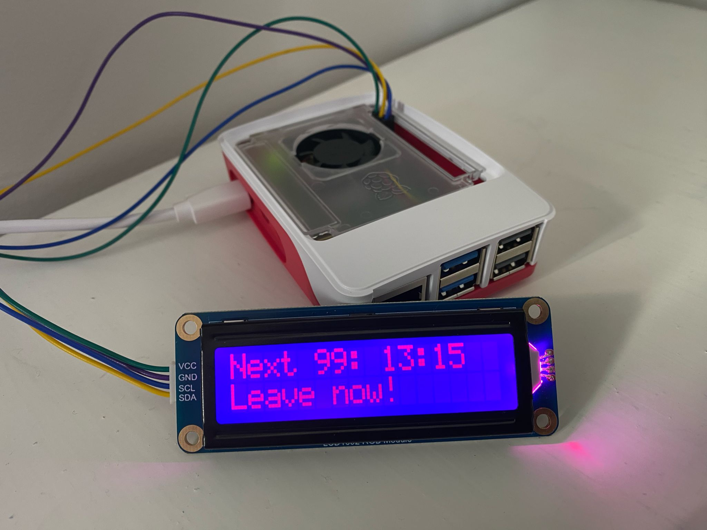

# My first Raspberry Pi project - displaying text on a mini LCD screen and exploring APIs

## Get live bus times from a specific bus stop in Edinburgh

### Request API for Edinburgh Travel Tracker

Click on API Key Request [here](https://www.edinburghtraveltracker.com/#/liveDepartures).
API documention is [here](https://tfe-opendata.readme.io/docs/).


### Set up virutal environment and install requirements

```
python3 -m venv .venv
source .venv/bin/activate
pip install -r requirements.txt
deactivate # to exit the virtual environment
```

### Store your API key and bus stop ID in a .env file

We don't want sensitive information in the python script making the API requests.
The API token is like a password so this should not be shared with anyone.
The bus stop ID may give away personal information, so I have also chosen not to share this.

The .env file should be in the root directory and looks a bit like this:
```
API_KEY=XXXXXXXXXXXXXXXXXXXXXXXXXXX
STOP_ID=123456789
```

For extra secruity this file should also be encrypted. See: https://emilylahren.com/2024/07/using-an-encrypted-env-file-with-your-python-script-to-secure-data/ for more info.

### Run the script
The script [`scripts/get_next_bus.py`](scripts/get_next_bus.py) prints text about when the next bus is (from a specific bus stop specified in `.env`) to a small LCD screen connected to a Raspberry Pi.
Once the API key and bus stop ID is in the .env file, then the script should run. It doesn't need any other input.
The output from the script, printed to the LCD screen, looks a bit like this:
```
Next 99 bus at 11:40
in 11 mins
```
Waits for 30 seconds then prints again:
```
Next 99: at 11:40
Leave now!
Next 99: at 11:40
Walk quickly!
Next 99: at 11:40
Walk quickly!
Next 99: at 11:40
Walk quickly!
Next 99: at 11:40
Walk quickly!
Next 99: at 11:40
Missed this bus!
```
This loop keeps going until the bus departure time is greater than the current time.

Here's an example output of the LCD screen:

